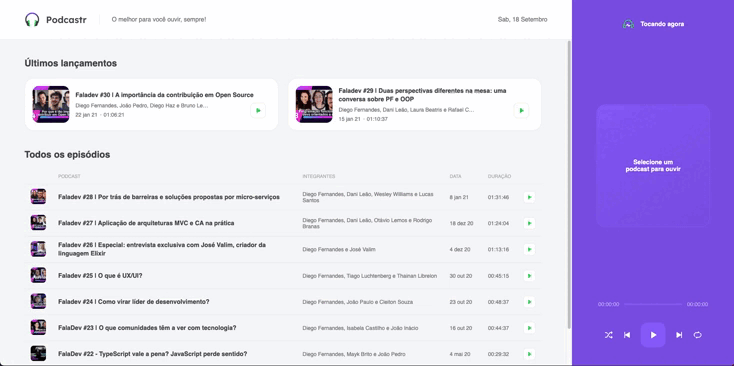

<div align="center">
  
  <h1>Podcast da Rockeatseat</h1>
  <h3 align="center">  
  <p align="center">
    <a href="#-sobre">Sobre</a>&nbsp;&nbsp;&nbsp;|&nbsp;&nbsp;&nbsp;
    <a href="#-tecnologias">Tecnologias</a>&nbsp;&nbsp;&nbsp;|&nbsp;&nbsp;&nbsp;
    <a href="#-como-executar">Como Executar</a>&nbsp;&nbsp;&nbsp;|&nbsp;&nbsp;&nbsp;
    <a href="#-licença">Licença</a>
  </p>
</h3>
  
  
</div>

## 📚 Sobre

O projeto consiste em uma plataforma que contém a lista de episódios de podcasts da ***Rocketseat***.

Cada episódio possui uma página própria trazendo mais detalhes e informações do episódio, além de um player básico de mídia para ouvir o podcast.

## 🚀 Tecnologias utilizadas:

- [ReactJS](https://react.dev/)
- [NextJS](https://nextjs.org/)
- [Typescript](https://www.typescriptlang.org/)
- [NodeJs](https://nodejs.org/pt)
- [Sass](https://sass-lang.com/)
- [rc-slider](https://www.npmjs.com/package/rc-slider)
- [date-fns](https://date-fns.org/)

## ⏱ Como executar

```bash
# Clonar o repositório
$ git clone https://github.com/polyanetuag/podcastrnext.git

# Entrar na pasta  
$ cd podcastrnext

# Instalar as dependências
$ yarn 

# Iniciar o servidor
$ yarn server

# Iniciar a aplicação
$ yarn dev

# O servidor será inicializado em <http://localhost:3000>
```

## 📝 Licença

Esse projeto está sob a licença MIT.

---
Desenvolvido com 💜 por Polyane Tuag


